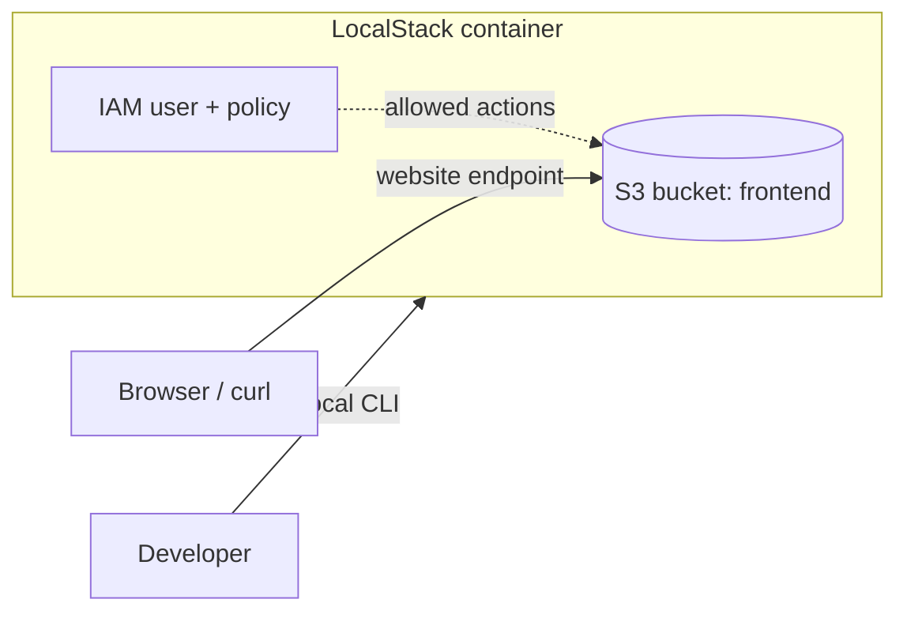

# ☁️ LocalStack Lab: S3 Static Website + IAM


Hands-on cloud lab that runs AWS services **locally** with LocalStack, so you can learn S3 and IAM without a real AWS account or any cost.

## ✨ What it does

- Hosts a static website from an **S3 bucket**
- Creates an **IAM user** with a **least-privilege policy**
- Rebuilds everything with **one script** (`setup.sh`)

## 🏗️ Architecture



## 🧰 Requirements

- Docker and Docker Compose
- A free [LocalStack](https://www.localstack.cloud) account and auth token
- `awslocal`: `pip install awscli-local`

## 🚀 Quick start

```bash
# 1. Clone
git clone git@github.com:AvotraAder/localstack.git
cd localstack

# 2. Add your token (this file is git-ignored, never commit it)
echo 'LOCALSTACK_AUTH_TOKEN=your-token-here' > .env

# 3. Start LocalStack
docker compose up -d

# 4. Build the lab
./setup.sh

# 5. Open the site
curl http://frontend.s3-website.localhost.localstack.cloud:4566/
```

`setup.sh` also writes `deployer.env` with the deployer's access keys. Load them with `source deployer.env` to act as `frontend-deployer`.

## 🔐 The IAM policy

`frontend-deployer` can only:

| Action | Resource | Why |
|---|---|---|
| `s3:ListBucket` | `arn:aws:s3:::frontend` | list the bucket itself |
| `s3:GetObject`, `s3:PutObject`, `s3:DeleteObject` | `arn:aws:s3:::frontend/*` | manage files inside it |

Listing applies to the bucket, while reading and writing apply to the objects, so they need separate statements.

## 📁 Project structure

```
.
├── docker-compose.yml    # LocalStack container (token read from .env)
├── deploy-policy.json    # IAM policy for the deployer
├── setup.sh              # bucket + site + user + policy + keys
└── frontend/             # website files
```

## 🧠 What I learned

- Creating S3 buckets, syncing files, and enabling website hosting
- IAM users, policies, ARNs and access keys
- Identity-based vs resource-based policies
- Keeping secrets out of Git (`.env`, `.gitignore`)
- Automating a manual setup with a Bash script

## ⚠️ Known issue

`ENFORCE_IAM=1` is set and reaches the container, but in my tests the deployer was **not denied** forbidden actions (for example, creating another bucket). IAM policy enforcement is still under investigation, so the policy is created and attached correctly but is not yet verified to block anything.

## 🛣️ Next steps

- [ ] Get IAM enforcement working and show a real `AccessDenied`
- [ ] Lambda functions
- [ ] SQS, SNS and DynamoDB
- [ ] Terraform against LocalStack
- [ ] CI pipeline that deploys to LocalStack

## 🔒 Security

Never commit `.env` or `deployer.env`. Both are listed in `.gitignore`.
