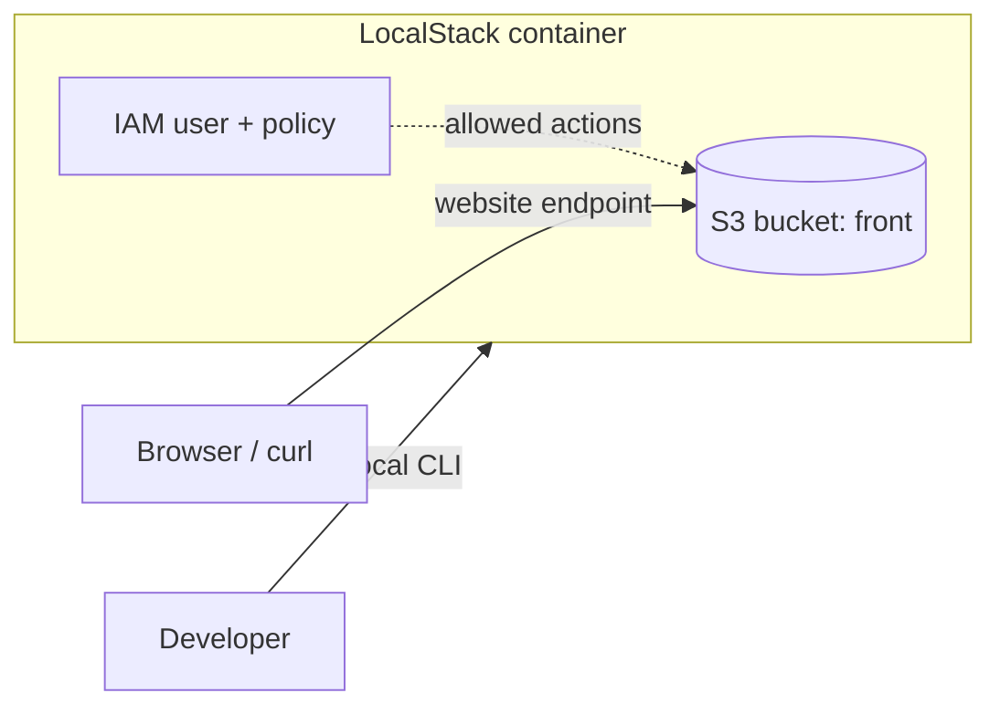

# ☁️ LocalStack Lab: S3 Static Website + IAM


Hands-on cloud lab that runs AWS services **locally** with LocalStack, so you can learn S3 and IAM without a real AWS account or any cost.

## ✨ What it does

- Hosts a static website from an **S3 bucket**
- Creates an **IAM user** with a **least-privilege policy**
- Keeps a full **version history** of files, with automatic cleanup via **lifecycle rules**
- Rebuilds everything with **one script** (`setup.sh`)

## 🏗️ Architecture


```mermaid
flowchart LR
    Dev[Developer] -->|awslocal CLI| LS[LocalStack :4566]
    subgraph LS[LocalStack container]
        S3[(S3 bucket: front)]
        IAM[IAM user + policy]
    end
    IAM -. allowed actions .-> S3
    Browser[Browser / curl] -->|website endpoint| S3
```

## 🧰 Requirements

- Docker and Docker Compose
- A free [LocalStack](https://www.localstack.cloud) account and auth token
- `awslocal`: `pip install awscli-local`

## 🚀 Quick start

```bash
# 1. Clone
git clone git@github.com:AvotraAder/localstack.git
cd localstack

# 2. Add your token (this file is git-ignored, never commit it)
echo 'LOCALSTACK_AUTH_TOKEN=your-token-here' > .env

# 3. Start LocalStack
docker compose up -d

# 4. Build the lab
./setup.sh

# 5. Open the site
curl http://front.s3-website.localhost.localstack.cloud:4566/
```

`setup.sh` also writes `deployer.env` with the deployer's access keys. Load them with `source deployer.env` to act as `frontend-deployer`.

## 🔐 The IAM policy

`frontend-deployer` can only:

| Action | Resource | Why |
|---|---|---|
| `s3:ListBucket` | `arn:aws:s3:::front` | list the bucket itself |
| `s3:GetObject`, `s3:PutObject`, `s3:DeleteObject` | `arn:aws:s3:::front/*` | manage files inside it |

Listing applies to the bucket, while reading and writing apply to the objects, so they need separate statements.

## 🕓 Versioning

Versioning is enabled on the bucket, so every overwrite keeps the previous copy instead of losing it:

```bash
awslocal s3api put-bucket-versioning \
  --bucket front --versioning-configuration Status=Enabled

awslocal s3api list-object-versions --bucket front --prefix index.html
```

Restoring an old version doesn't delete anything — it copies the old content back as a *new* version, so the full history stays intact:

```bash
awslocal s3api copy-object \
  --bucket front \
  --copy-source 'front/index.html?versionId=<OLD_VERSION_ID>' \
  --key index.html \
  --metadata-directive REPLACE
```

`--metadata-directive REPLACE` is required because the source and destination share the same key.

## 🗑️ Lifecycle rules

Defined in `lifecycle.json` and applied with `put-bucket-lifecycle-configuration`:

| Rule | Applies to | Action |
|---|---|---|
| `expire-old-versions` | non-current object versions | delete after 30 days |
| `expire-tmp-folder` | objects under `tmp/` | delete after 7 days |

This keeps version history from growing forever without deleting the current live files.

## 📁 Project structure
.
├── docker-compose.yml # LocalStack container (token read from .env)
├── deploy-policy.json # IAM policy for the deployer
├── lifecycle.json # S3 lifecycle rules
├── setup.sh # bucket + site + user + policy + keys
└── frontend/ # website files


## 🧠 What I learned

- Creating S3 buckets, syncing files, and enabling website hosting
- S3 versioning: how overwrites and restores actually work under the hood
- Lifecycle rules to auto-expire old versions and temp files
- IAM users, policies, ARNs and access keys
- Identity-based vs resource-based policies
- Keeping secrets out of Git (`.env`, `.gitignore`)
- Automating a manual setup with a Bash script

## 🛣️ Next steps

- [ ] Get IAM enforcement working and show a real `AccessDenied`
- [ ] Presigned URLs for temporary private access
- [ ] Lambda functions
- [ ] SQS, SNS and DynamoDB
- [ ] Terraform against LocalStack
- [ ] CI pipeline that deploys to LocalStack
