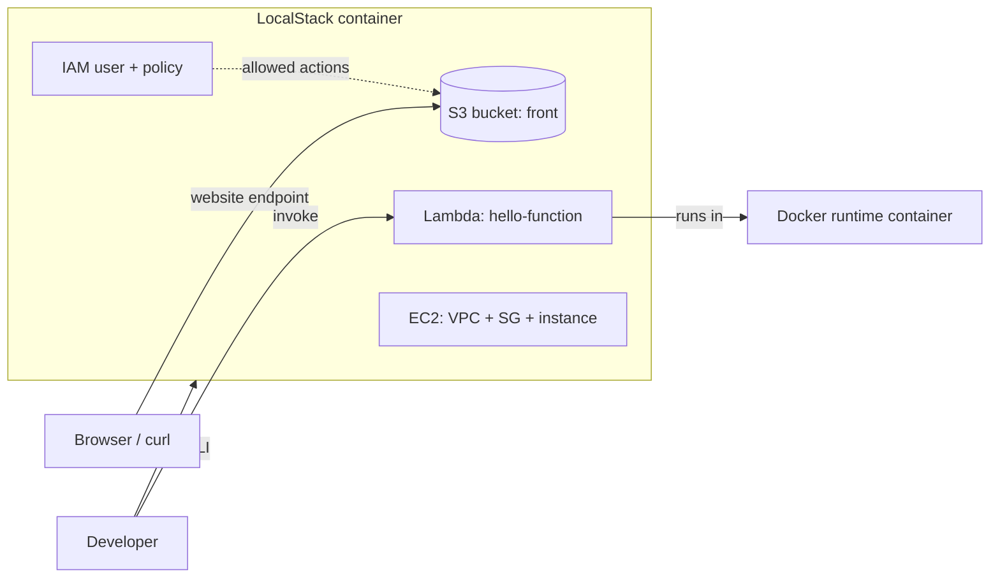

# ☁️ LocalStack Lab: AWS Services Playground


Hands-on cloud lab that runs AWS services **locally** with LocalStack, so you can learn S3, IAM, Lambda and EC2 without a real AWS account or any cost.

## ✨ What it does

- Hosts a static website from an **S3 bucket**
- Creates an **IAM user** with a **least-privilege policy**
- Keeps a full **version history** of files, with automatic cleanup via **lifecycle rules**
- Runs real serverless code with **Lambda**, executed in an actual Docker container
- Simulates a **VPC, security group and EC2 instance** lifecycle
- Rebuilds the S3/IAM part with **one script** (`setup.sh`)

## 🏗️ Architecture


```mermaid
flowchart LR
    Dev[Developer] -->|awslocal CLI| LS[LocalStack :4566]
    subgraph LS[LocalStack container]
        S3[(S3 bucket: front)]
        IAM[IAM user + policy]
        Lambda[Lambda: hello-function]
        EC2[EC2: VPC + SG + instance]
    end
    IAM -. allowed actions .-> S3
    Browser[Browser / curl] -->|website endpoint| S3
    Dev -->|invoke| Lambda
    Lambda -->|runs in| DockerRuntime[Docker runtime container]
```

## 🧰 Requirements

- Docker and Docker Compose
- The Docker CLI binary must be reachable **inside** the LocalStack container (required for Lambda to spawn runtime containers) — see `docker-compose.yml`
- A free [LocalStack](https://www.localstack.cloud) account and auth token
- `awslocal`: `pip install awscli-local`

## 🚀 Quick start

```bash
# 1. Clone
git clone git@github.com:AvotraAder/localstack.git
cd localstack

# 2. Add your token (this file is git-ignored, never commit it)
echo 'LOCALSTACK_AUTH_TOKEN=your-token-here' > .env

# 3. Start LocalStack
docker compose up -d

# 4. Build the S3 + IAM part
./setup.sh

# 5. Open the site
curl http://front.s3-website.localhost.localstack.cloud:4566/
```

`setup.sh` also writes `deployer.env` with the deployer's access keys. Load them with `source deployer.env` to act as `frontend-deployer`.

## 🔐 The IAM policy

`frontend-deployer` can only:

| Action | Resource | Why |
|---|---|---|
| `s3:ListBucket` | `arn:aws:s3:::front` | list the bucket itself |
| `s3:GetObject`, `s3:PutObject`, `s3:DeleteObject` | `arn:aws:s3:::front/*` | manage files inside it |

Listing applies to the bucket, while reading and writing apply to the objects, so they need separate statements.

## 🕓 Versioning

Versioning is enabled on the bucket, so every overwrite keeps the previous copy instead of losing it:

```bash
awslocal s3api put-bucket-versioning \
  --bucket front --versioning-configuration Status=Enabled

awslocal s3api list-object-versions --bucket front --prefix index.html
```

Restoring an old version doesn't delete anything — it copies the old content back as a *new* version, so the full history stays intact:

```bash
awslocal s3api copy-object \
  --bucket front \
  --copy-source 'front/index.html?versionId=<OLD_VERSION_ID>' \
  --key index.html \
  --metadata-directive REPLACE
```

`--metadata-directive REPLACE` is required because the source and destination share the same key.

## 🗑️ Lifecycle rules

Defined in `lifecycle.json` and applied with `put-bucket-lifecycle-configuration`:

| Rule | Applies to | Action |
|---|---|---|
| `expire-old-versions` | non-current object versions | delete after 30 days |
| `expire-tmp-folder` | objects under `tmp/` | delete after 7 days |

This keeps version history from growing forever without deleting the current live files.

## ⚡ Lambda

A Python function deployed and invoked locally:

```bash
awslocal lambda create-function \
  --function-name hello-function \
  --runtime python3.12 \
  --handler handler.handler \
  --role arn:aws:iam::000000000000:role/lambda-exec-role \
  --zip-file fileb://lambda/function.zip

awslocal lambda invoke \
  --function-name hello-function \
  --payload '{"name": "Avotra"}' \
  --cli-binary-format raw-in-base64-out \
  response.json
```

Unlike EC2 (below), Lambda actually **executes** the code — LocalStack spins up a real Docker container per invocation. This requires the `docker` binary to be available inside the LocalStack container (mounted in `docker-compose.yml`); without it, functions stay stuck in `Pending` forever.

## 🖥️ EC2

Simulates the EC2 API: VPC, security groups, instances, tags, and the stop/start/terminate lifecycle.

```bash
awslocal ec2 create-security-group --group-name web-sg --description "Allow SSH and HTTP" --vpc-id <VPC_ID>
awslocal ec2 authorize-security-group-ingress --group-id <SG_ID> --protocol tcp --port 22 --cidr 0.0.0.0/0
awslocal ec2 run-instances --image-id <AMI_ID> --instance-type t2.micro --security-group-ids <SG_ID> --count 1
awslocal ec2 create-tags --resources <INSTANCE_ID> --tags Key=Name,Value=web-server-1
```

**Important limitation:** in LocalStack Community, EC2 is an **API mock only** — instances get a real ID, state and tags, but no actual OS boots. There is nothing to SSH into. This is different from Lambda, where code genuinely runs. Full instance emulation is a LocalStack Pro feature.

## 📁 Project structure

```
.
├── docker-compose.yml    # LocalStack container (token read from .env, docker binary mounted)
├── deploy-policy.json    # IAM policy for the deployer
├── lifecycle.json        # S3 lifecycle rules
├── lambda-trust-policy.json  # trust policy for the Lambda execution role
├── lambda/                # Lambda function source + zip
├── setup.sh               # bucket + site + user + policy + keys
└── frontend/               # website files
```

## 🧠 What I learned

- Creating S3 buckets, syncing files, and enabling website hosting
- S3 versioning: how overwrites and restores actually work under the hood
- Lifecycle rules to auto-expire old versions and temp files
- IAM users, policies, ARNs, roles and access keys
- Identity-based vs resource-based policies, trust policies
- Deploying and invoking Lambda functions, and why they need Docker-in-Docker access
- EC2 core objects (VPC, security groups, instances, tags) and their lifecycle
- The difference between services LocalStack truly executes (S3, Lambda) and services it only mocks at the API level (EC2 in Community edition)
- Keeping secrets out of Git (`.env`, `.gitignore`)
- Automating a manual setup with a Bash script

## ⚠️ Known issues

- `ENFORCE_IAM=1` is set and reaches the container, but the deployer was **not denied** forbidden actions in my tests (e.g. creating another bucket). Same pattern observed with S3 object ACLs (`private` didn't actually block access). Policy/ACL enforcement in LocalStack Community appears limited; under investigation.
- EC2 instances are API-only in Community edition: no real compute, no SSH access.

## 🛣️ Next steps

- [ ] Get IAM/ACL enforcement working and show a real `AccessDenied`
- [ ] Presigned URLs for temporary private access
- [ ] SQS, SNS and DynamoDB
- [ ] Terraform against LocalStack
- [ ] CI pipeline that deploys to LocalStack

